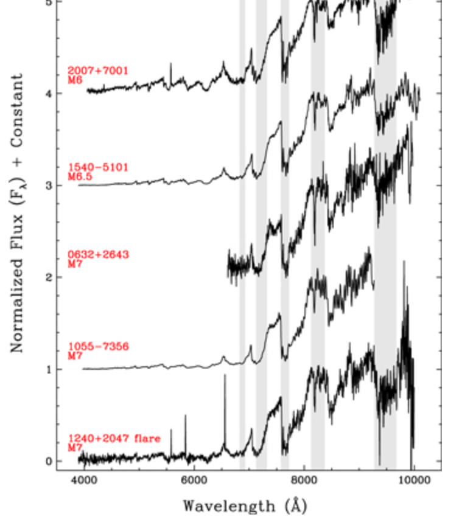
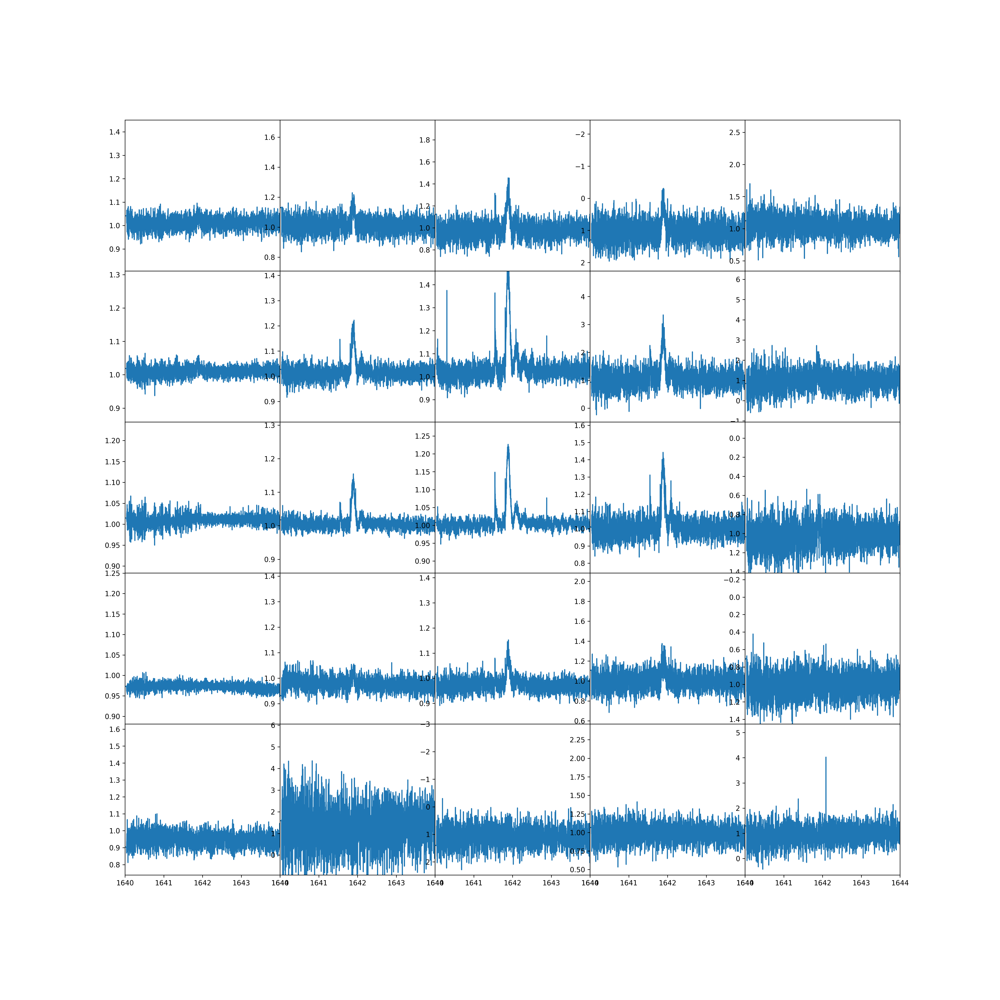
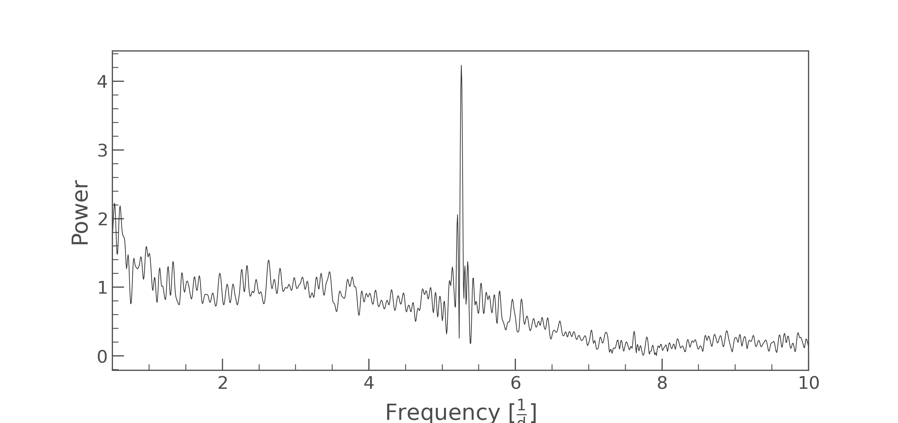
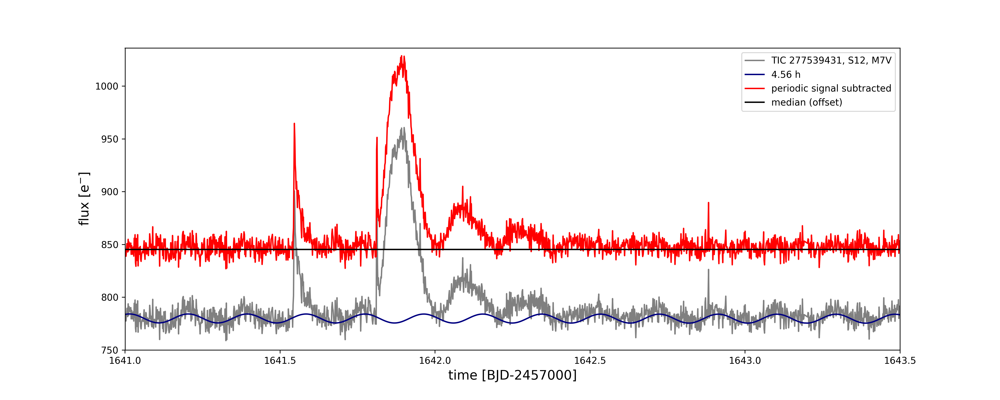
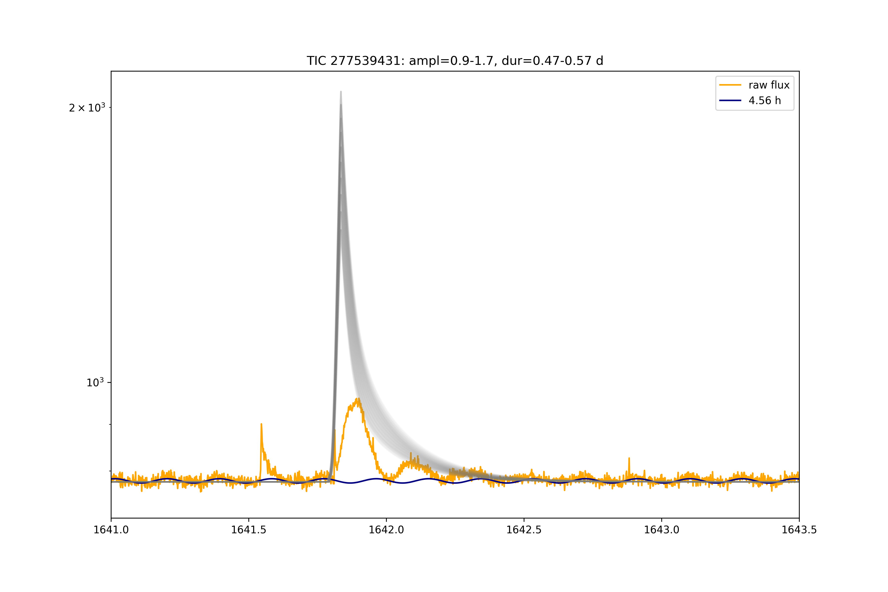
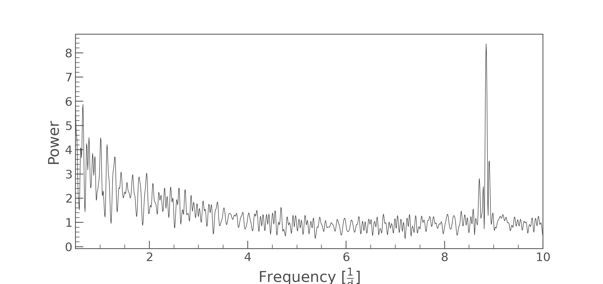
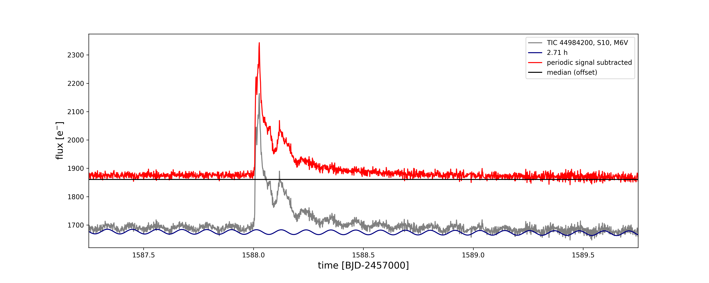
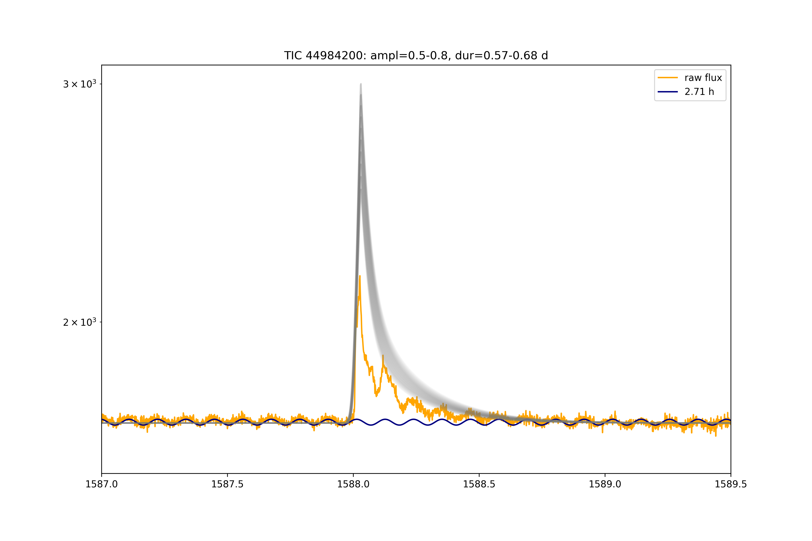

# Multiperiod flares

There are several ultra-fast rotating mid-to-late M dwarfs that exhibit a large flare each that lasts more than one rotation period.

## TIC 277539431, sector 12

The feature really occurs on the star. It is centered in the 2nd row 3rd column.

Modulation period: 4.56 h

Estimated ED from duration-ED relation: 18366-23989 s

Estimated ED from flare fit: 8922+/-1832 s

Relative amplitude of modulation: 5.4e-03

The dominant period is 4.6 hours.

## TIC 44984200, sector 10

Modulation period: 2.71 h

Estimated ED from duration-ED relation: 23689-30942 s

Estimated ED from flare fit: 5302+/-843 s

Relative amplitude of modulation: 4.9e-03

The dominant period is 2.7 hours.

## TIC 237880881 (S1)

## EPIC 2120353401 (C18)

## WISEP J190648.47+401106.8 (Kepler Q14, Q16)

---

## Discussion

Besides the giant, TIC 44984200 has only two marginal flares. TIC 277539431 shows three flares in its LC, the largest of which is preceding the giant one and has an amplitude of 15%.

Less impulsive >>> cooler flare.

### Single star with active region and flare

Is the flare rotating in and out view?
We can see it on the bright side of the star. If the active region that causes the photometric modulation is cospatial with the flaring region, the active region is in total brighter than the quiescent star.

### Ultra-fast spinning UCDs

measurements  of vsin i suggest all L dwarfs are rapid rotators (Bailer-Jones2004; Reiners &Basri2008) - Gizis+2013

### Eclipsing UCD binary / ultra-HJ companion

Can we rule out a companion?
If not, is it SPI?

## Acknowledgements

Heavy use of lightkurve, including `to_periodogram`, also `scipy.optimize`.

